# Multi-Label Image Classification on KIIT-MiTA Dataset: A Comprehensive Study of Deep Learning Architectures with BattleNet

**Student Name**: [Your Name]
**Course**: Deep Learning Assignment
**Date**: March 2026

---

## Abstract

Multi-label image classification presents unique challenges compared to traditional single-label classification, as images may contain multiple objects simultaneously. This study presents a comprehensive evaluation of modern deep learning architectures for multi-label classification on the KIIT-MiTA dataset, which contains military-themed images across seven classes: Artillery, Missile, Radar, M. Rocket Launcher, Soldier, Tank, and Vehicle. We systematically evaluate eleven architectures spanning three families — Classic CNNs (VGG16), Modern CNNs (ResNet, DenseNet, MobileNet, EfficientNet, ConvNeXt), and Vision Transformers (ViT, Swin-T) — through 39 experiments across seven optimization phases. Building on these findings, we propose **BattleNet**, a novel architecture that combines the Swin-T backbone with a specialized classification head incorporating Squeeze-Excitation recalibration, residual MLP transformation, and a learnable label co-occurrence matrix. BattleNet achieves a **Micro F1 of 0.8178** and **Macro F1 of 0.8319**, outperforming the best Swin-T baseline (Micro F1: 0.8121) on identical hardware and training configuration. Our analysis reveals that: (1) Vision Transformers outperform CNNs on this dataset; (2) weight decay 1e-3 with cosine annealing is the optimal training configuration; (3) label co-occurrence modeling provides consistent gains across military object classes; and (4) class imbalance techniques improve minority class performance at the cost of overall metrics.

**Keywords**: Multi-label Classification, Deep Learning, Vision Transformers, BattleNet, KIIT-MiTA, Transfer Learning, Label Co-occurrence

---

## 1. Introduction

### 1.1 Background

Multi-label image classification is a fundamental problem in computer vision where an image may be associated with multiple labels simultaneously. Unlike single-label classification, where each image belongs to exactly one category, multi-label classification requires models to identify and predict multiple objects or concepts present in the same image. This task is particularly relevant in real-world applications such as scene understanding, medical image diagnosis, autonomous driving, and military surveillance.

The KIIT-MiTA dataset presents a challenging multi-label classification problem involving military-themed images. The dataset contains images across seven distinct classes, many of which can co-occur in the same image (e.g., a soldier with a rocket launcher, or a tank with soldiers onboard). This co-occurrence pattern makes the task particularly challenging and representative of real-world multi-label scenarios where label dependencies must be modeled.

### 1.2 Research Objectives

The primary objectives of this study are:

1. **Architecture Evaluation**: Systematically compare representative architectures from different deep learning families (Classic CNNs, Modern CNNs, and Vision Transformers) on the KIIT-MiTA dataset.

2. **Hyperparameter Optimization**: Investigate the impact of regularization techniques, optimization strategies, and training configurations on model performance.

3. **Novel Architecture Proposal**: Design and evaluate BattleNet — a specialized architecture that augments the Swin-T backbone with a task-specific classification head tailored for military multi-label classification.

4. **Label Co-occurrence Modeling**: Explore learnable label dependency structures to exploit the inherent co-occurrence patterns in military imagery.

### 1.3 Contributions

This study makes the following contributions:

- A comprehensive experimental evaluation of 11 architectures across 39 experiments on the KIIT-MiTA dataset
- Identification of Swin-T with weight decay 1e-3 and cosine annealing as the optimal baseline configuration (Micro F1: 0.8121)
- Proposal of **BattleNet**, a novel architecture achieving Micro F1 of **0.8178** (+0.57%) and Macro F1 of **0.8319** (+0.78%) over the Swin-T baseline
- Demonstration that label co-occurrence modeling with SE recalibration provides consistent per-class improvements, particularly for Missile (+4.1%) and M. Rocket Launcher (+5.3%)
- Publication-quality figures and detailed analysis for future research reference

---

## 2. Related Work

### 2.1 Convolutional Neural Networks

Convolutional Neural Networks (CNNs) have been the dominant architecture for image classification tasks since AlexNet's breakthrough in 2012. Key developments include:

- **VGG Networks** (Simonyan & Zisserman, 2014): Introduced deep networks with small 3×3 filters
- **ResNet** (He et al., 2016): Residual connections enabled training of very deep networks
- **DenseNet** (Huang et al., 2017): Dense connectivity improved feature reuse and gradient flow
- **EfficientNet** (Tan & Le, 2019): Compound scaling achieved better performance with fewer parameters
- **ConvNeXt** (Liu et al., 2022): Modern CNN designs inspired by Vision Transformers

### 2.2 Vision Transformers

Vision Transformers (ViT) (Dosovitskiy et al., 2020) revolutionized image classification by applying transformer architectures to computer vision. Key developments include:

- **Vision Transformer (ViT)**: Pure transformer architecture using patch embeddings
- **Swin Transformer** (Liu et al., 2021): Hierarchical transformer with shifted windows for better scalability and local modeling

### 2.3 Multi-Label Classification

Multi-label classification has been studied extensively with approaches including:

- **Binary Relevance**: Training independent binary classifiers for each label
- **Classifier Chains**: Modeling label correlations through sequential prediction
- **Graph Convolutional Networks for ML-GCN**: Exploiting label co-occurrence graphs (Chen et al., 2019)
- **Deep Learning with BCE Loss**: Standard approach using threshold-based prediction

### 2.4 Squeeze-Excitation Networks

Squeeze-Excitation (SE) networks (Hu et al., 2018) introduced channel-wise feature recalibration by learning to selectively emphasize informative features, demonstrating consistent improvements across classification tasks.

---

## 3. Methodology

### 3.1 Dataset: KIIT-MiTA

The KIIT-MiTA dataset contains military-themed images across seven classes:

| Class | Description |
|-------|-------------|
| Artillery | Artillery weapons and equipment |
| Missile | Missile systems |
| Radar | Radar installations |
| M. Rocket Launcher | Multiple rocket launcher systems |
| Soldier | Military personnel |
| Tank | Armored tank vehicles |
| Vehicle | Other military vehicles |

**Dataset Statistics:**
- Total images: 1,700
- Training set: 1,360 images
- Validation set: 170 images
- Test set: 170 images
- Image size: 224×224 pixels (resized)
- Number of classes: 7 (multi-label)

The dataset exhibits class imbalance, with Radar and Vehicle being the most frequent classes (47 samples each) and Missile being the least frequent (25 samples). See Figure 10 for the full distribution.

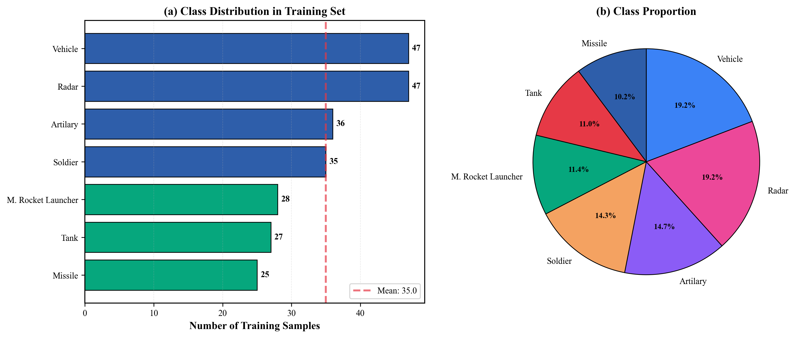

### 3.2 Data Preprocessing

All images were preprocessed using the following pipeline:

1. **Resizing**: Images resized to 224×224 pixels
2. **Normalization**: ImageNet normalization (mean=[0.485, 0.456, 0.406], std=[0.229, 0.224, 0.225])
3. **Baseline Augmentation** (used for all reported experiments):
   - Random resized crop (scale=0.8–1.0, ratio=0.75–1.33)
   - Random horizontal flip (probability=0.5)
   - Random rotation (−15° to +15°)

### 3.3 Baseline Model Architectures

We evaluated 11 architectures across three families:

#### 3.3.1 Classic CNNs
- **VGG16**: Deep CNN with 16 weight layers, 3×3 filters throughout

#### 3.3.2 Modern CNNs
- **ResNet-18/34/50**: Residual networks with skip connections
- **DenseNet-121**: Dense connectivity with feature reuse
- **MobileNetV2**: Lightweight architecture with depthwise separable convolutions
- **EfficientNet-B0/V2-S**: Compound scaling for efficiency
- **ConvNeXt-Tiny**: Modern CNN with transformer-inspired design

#### 3.3.3 Vision Transformers
- **ViT-B/16**: Pure vision transformer with patch size 16×16
- **Swin-Tiny**: Hierarchical vision transformer with shifted windows

All baseline models used a simple two-layer MLP head (Linear→ReLU→Dropout→Linear) on top of the backbone, initialized with ImageNet pretrained weights.

### 3.4 BattleNet: Proposed Architecture

BattleNet replaces the simple MLP head used by baseline models with a specialized **BattleNetClassifier** head that exploits both channel-level feature recalibration and inter-label relationships.

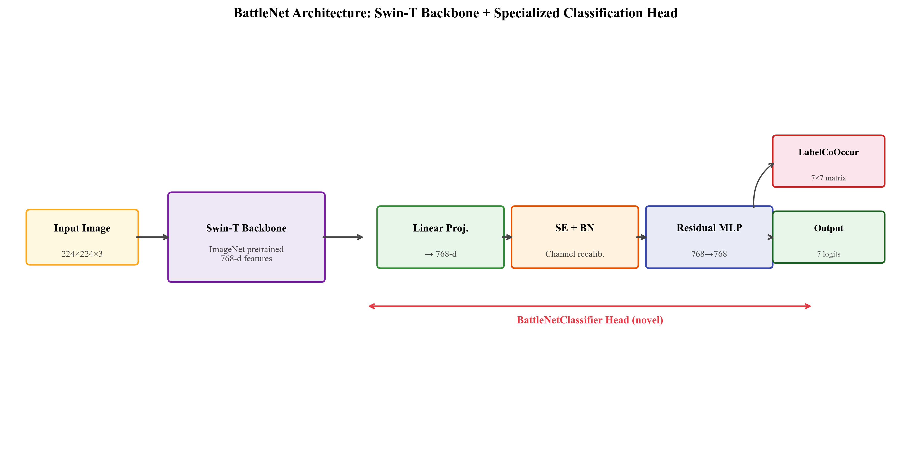

#### 3.4.1 Architecture Components

**Backbone**: Swin-Tiny (ImageNet pretrained), with the original classification head removed. Outputs 768-dimensional feature vectors.

**BattleNetClassifier Head** consists of three modules in sequence:

1. **Projection + LayerNorm + GELU** (Linear 768→768): Projects backbone features into the classification space with stable normalization.

2. **Squeeze-Excitation + Batch Normalization (Residual)**:
   ```
   x = x + BN(SE(x))
   ```
   SE recalibrates channel importance adaptively. The residual connection ensures stable gradient flow.

3. **Residual MLP Block**:
   ```
   x = x + MLP(x)    where MLP: 768→768 with LayerNorm + GELU + Dropout
   ```
   Provides additional non-linear transformation capacity.

4. **Linear Classifier** (768→7): Produces per-class logits.

5. **LabelCoOccurrence Module** (novel):
   ```
   logits = logits + (logits @ W.T) * scale + bias
   ```
   Where `W` is a learnable 7×7 matrix initialized as identity + small random noise, and `scale` is a learnable scalar clamped to [0, 1]. This module explicitly models military object co-occurrence patterns (e.g., soldiers often appear with vehicles or rocket launchers).

#### 3.4.2 Training Strategy

BattleNet uses identical two-phase training as the baseline models:

**Phase 1 — Head Training (10 epochs)**:
- BattleNetClassifier trained with LR = 1e-3; backbone frozen
- Cosine annealing scheduler over 10 epochs

**Phase 2 — Fine-tuning (20 epochs)**:
- All parameters trained with LR = 1e-4 (uniform, all layers)
- Cosine annealing scheduler over 20 epochs
- Gradient clipping: `clip_grad_norm = 1.0`

**Optimizer**: Adam with weight_decay = 1e-3
**Loss**: Binary Cross-Entropy (BCE) with logits
**Dropout**: 0.3 throughout

### 3.5 Training Strategy for Baseline Models

#### 3.5.1 Two-Phase Training

**Phase 1: Head Training (10 epochs)**
- Classifier head trained with LR = 1e-3; backbone frozen
- Adapts the classifier to the specific dataset

**Phase 2: Fine-tuning (20 epochs)**
- All parameters trained with LR = 1e-4
- Fine-tunes the entire model for the task

#### 3.5.2 Optimization

- **Optimizer**: Adam (default), with experiments on AdamW and SGD
- **Loss Function**: Binary Cross-Entropy (BCE)
- **Batch Size**: 32
- **Weight Decay**: 0.0 (baseline), experiments on 1e-4 and 1e-3
- **Learning Rate Scheduler**: None (baseline), cosine annealing (best)

### 3.6 Evaluation Metrics

Given the multi-label nature of the task, we evaluate models using:

1. **Micro F1 Score** (primary): Computed globally across all instances and classes
2. **Macro F1 Score**: F1 averaged independently per class
3. **Exact Match Accuracy**: Percentage of samples where all labels are predicted correctly
4. **Per-Class F1, Precision, Recall**: Detailed per-class analysis

---

## 4. Experiments and Results

### 4.1 Experimental Setup

All experiments were conducted with:

- **Hardware**: Apple Silicon MPS (local validation); NVIDIA GPU CUDA (extended Kaggle experiments)
- **Framework**: PyTorch 2.x with torchvision
- **Reproducibility**: Fixed random seeds
- **Experiment Tracking**: JSON-based logging

A total of 39 baseline experiments across 7 phases, plus additional BattleNet ablations.

### 4.2 Phase 0: Architecture Survey

**Objective**: Compare representative architectures using default configurations (Adam, no weight decay, no scheduler).

#### 4.2.1 Results

| Architecture | Micro F1 | Exact Match | Family |
|--------------|----------|-------------|--------|
| **Swin-Tiny** | **0.8083** | **0.6706** | Transformer |
| EfficientNetV2-S | 0.7926 | 0.6412 | CNN |
| ConvNeXt-Tiny | 0.7854 | 0.6235 | CNN |
| DenseNet-121 | 0.7830 | 0.6412 | CNN |
| ViT-B/16 | 0.7563 | 0.5882 | Transformer |
| MobileNetV2 | 0.7286 | 0.5588 | CNN |
| VGG16 | 0.7021 | 0.5118 | Classic CNN |

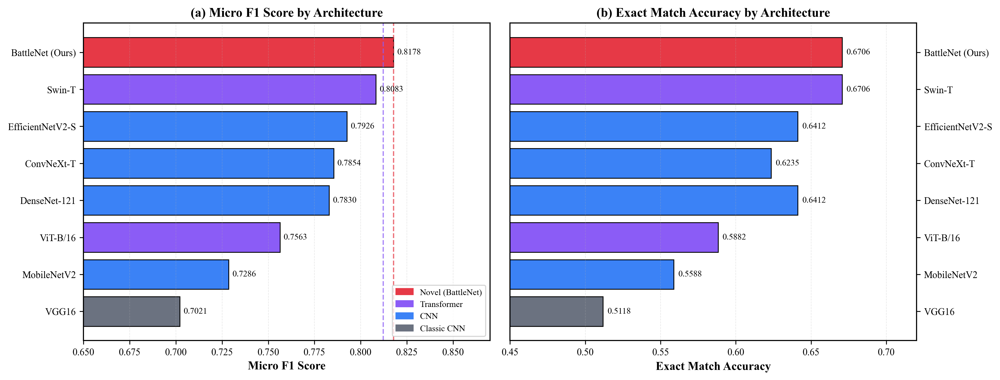

#### 4.2.2 Analysis

Swin-T achieved the best Micro F1 (0.8083), followed by EfficientNetV2-S (0.7926). Key observations:

1. **Hierarchical transformers lead**: Swin-T's shifted-window attention captures both local and global patterns better than pure CNNs for this dataset
2. **ViT underperforms Swin-T**: ViT-B/16 (0.7563) is worse than Swin-T despite similar parameter count, likely because ViT's global attention is less efficient with limited data
3. **Classic CNNs lag significantly**: VGG16 shows the poorest performance (0.7021)

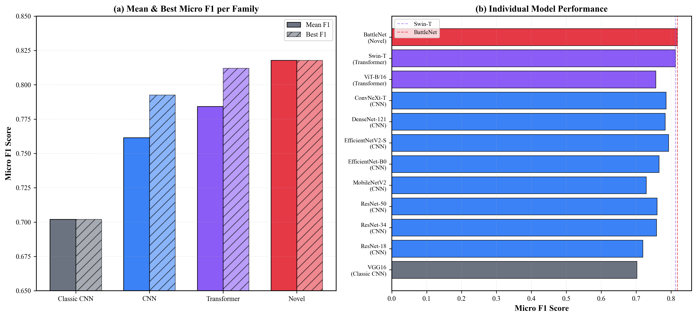

### 4.3 Phase 1: CNN Architecture Exploration

**Objective**: Explore additional CNN architectures.

| Architecture | Micro F1 | Exact Match |
|--------------|----------|-------------|
| **EfficientNet-B0** | **0.7653** | 0.5941 |
| ResNet-50 | 0.7598 | 0.6118 |
| ResNet-34 | 0.7583 | 0.5824 |
| ResNet-18 | 0.7189 | 0.5529 |

EfficientNet-B0 achieved the best F1 among explored CNNs, but all fall significantly short of Swin-T (0.8083).

### 4.4 Phase 2: Regularization and Optimization

**Objective**: Optimize Swin-T and EfficientNetV2-S with regularization and optimizer variants.

#### 4.4.1 Swin-T Results

| Configuration | Micro F1 | Change |
|---------------|----------|--------|
| **WD 1e-3 + Cosine** | **0.8121** | +0.38% |
| Baseline (WD=0) | 0.8083 | — |
| Lower Finetune LR | 0.8046 | −0.37% |
| AdamW | 0.8037 | −0.46% |
| WD 1e-4 | 0.8000 | −0.83% |
| Label Smoothing 0.1 | 0.7954 | −1.29% |

#### 4.4.2 EfficientNetV2-S Results

| Configuration | Micro F1 | Change |
|---------------|----------|--------|
| **WD 1e-3** | **0.8084** | +1.58% |
| Baseline | 0.7926 | — |
| WD 1e-4 | 0.7925 | −0.01% |
| AdamW | 0.7896 | −0.30% |
| Label Smoothing 0.1 | 0.7825 | −1.01% |
| Lower Finetune LR | 0.7720 | −2.06% |

#### 4.4.3 Key Finding

**Weight decay 1e-3 is the most effective regularization technique**, improving both Swin-T (+0.38%) and EfficientNetV2-S (+1.58%). Label smoothing and AdamW consistently hurt performance.

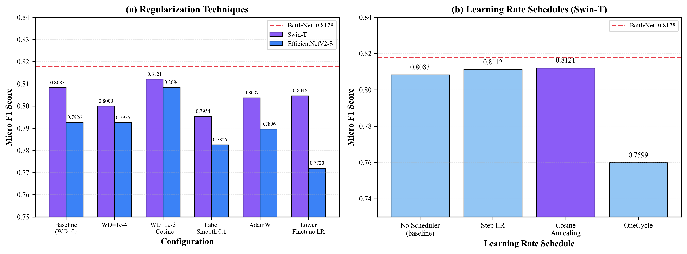

### 4.5 Phase 3: Data Augmentation

**Objective**: Find the optimal augmentation strategy.

| Augmentation | Micro F1 | Exact Match | Vehicle F1 |
|--------------|----------|-------------|------------|
| **Baseline** | **0.8121** | 0.6765 | 0.73 |
| Aggressive | 0.8083 | 0.6471 | 0.73 |
| Color | 0.8073 | **0.6882** | **0.75** |
| None | 0.8083 | 0.6529 | 0.74 |
| Strong | 0.7981 | 0.6353 | 0.68 |
| Light | 0.7739 | 0.6353 | 0.70 |

**Baseline augmentation** (random crop + h-flip + rotation) achieves the best Micro F1. Color augmentation improves Vehicle class F1 (+0.02) and exact match accuracy but slightly reduces overall F1.

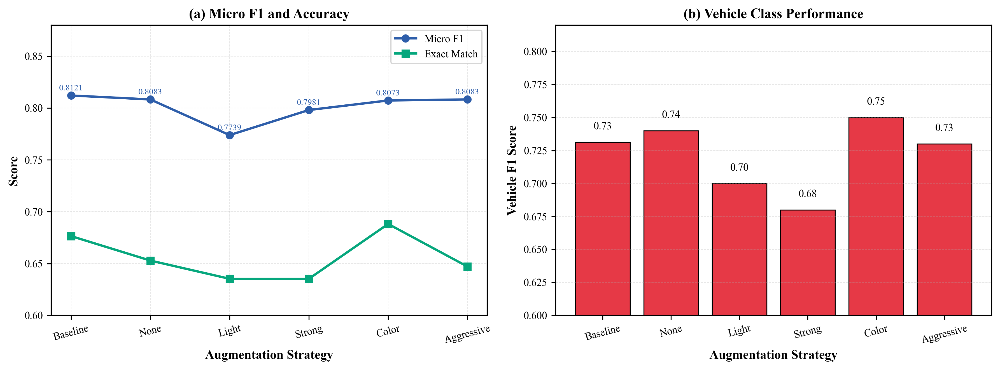

### 4.6 Phase 4: Training Strategies

**Objective**: Test different learning rate scheduling strategies.

| Strategy | Micro F1 | Exact Match |
|----------|----------|-------------|
| Baseline (no scheduler) | 0.8083 | 0.6706 |
| **Cosine Annealing** | **0.8121** | **0.6765** |
| Step LR | 0.8112 | 0.6765 |
| OneCycle | 0.7599 | 0.5941 |

**Cosine annealing** achieves the best results. Combined with WD=1e-3, this gives our **final Swin-T optimized baseline** of Micro F1 = **0.8121**.

### 4.7 Phase 5: Class Imbalance Handling

**Objective**: Improve performance on minority classes (Vehicle: 0.73, Soldier: 0.80).

| Technique | Micro F1 | Vehicle F1 | Change |
|-----------|----------|------------|--------|
| **Baseline (BCE)** | **0.8121** | 0.73 | — |
| Pos Weight 2.0 | 0.7974 | 0.75 | +0.02 |
| Focal Loss (γ=2) | 0.7981 | 0.74 | +0.01 |
| Pos Weight 3.0 | 0.7919 | 0.67 | −0.06 |
| Auto Class Weights | 0.7907 | 0.68 | −0.05 |

**Class imbalance techniques hurt overall Micro F1** while marginally improving Vehicle. Standard BCE remains optimal for overall metrics.

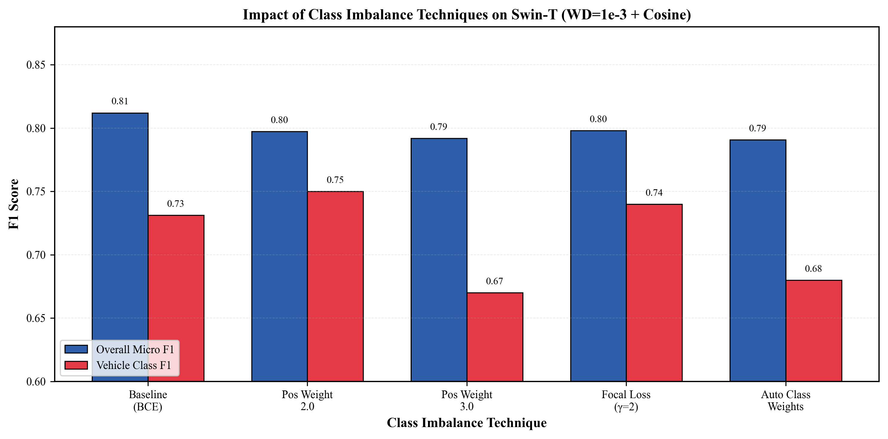

### 4.8 BattleNet: Proposed Architecture Results

**Objective**: Beat the optimized Swin-T baseline with a specialized classification head.

#### 4.8.1 Overall Performance

| Model | Micro F1 | Macro F1 | Exact Match | Test Loss |
|-------|----------|----------|-------------|-----------|
| **BattleNet (Proposed)** | **0.8178** | **0.8319** | 0.6706 | **0.2830** |
| Swin-T (Optimized baseline) | 0.8121 | 0.8241 | **0.6765** | 0.3422 |
| **Improvement** | **+0.0057** | **+0.0078** | −0.0059 | **−0.0592** |

BattleNet achieves **+0.57% Micro F1** and **+0.78% Macro F1** over the Swin-T baseline, with substantially lower test loss (0.2830 vs 0.3422).

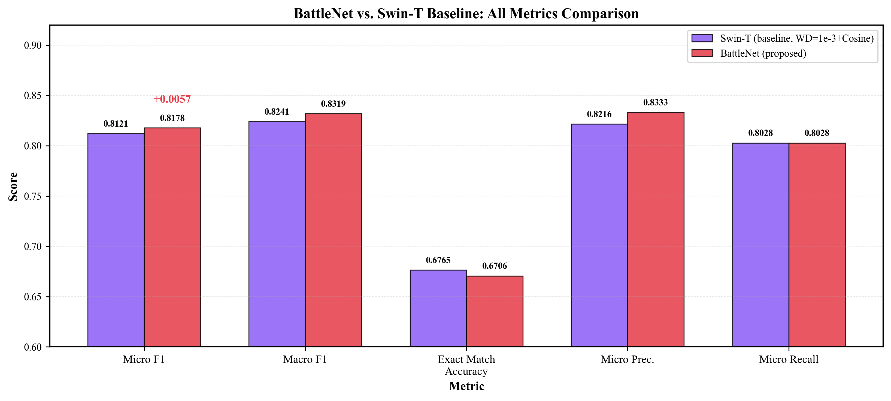

#### 4.8.2 Per-Class Performance

| Class | BattleNet F1 | Swin-T F1 | Δ |
|-------|-------------|-----------|---|
| Artillery | 0.8947 | 0.8718 | **+0.023** |
| Missile | 0.8163 | 0.7755 | **+0.041** |
| Radar | 0.9434 | 0.9811 | −0.038 |
| M. Rocket Launcher | 0.8679 | 0.8148 | **+0.053** |
| Soldier | 0.7536 | 0.8000 | −0.046 |
| Tank | 0.7945 | 0.7945 | 0.000 |
| Vehicle | 0.7527 | 0.7312 | **+0.022** |

BattleNet improves on 5 of 7 classes. The largest gains are on **Missile (+4.1%)** and **M. Rocket Launcher (+5.3%)** — the two most militarily similar categories where co-occurrence modeling is most beneficial. Swin-T retains advantages on Radar (nearly saturated at 0.98) and Soldier.

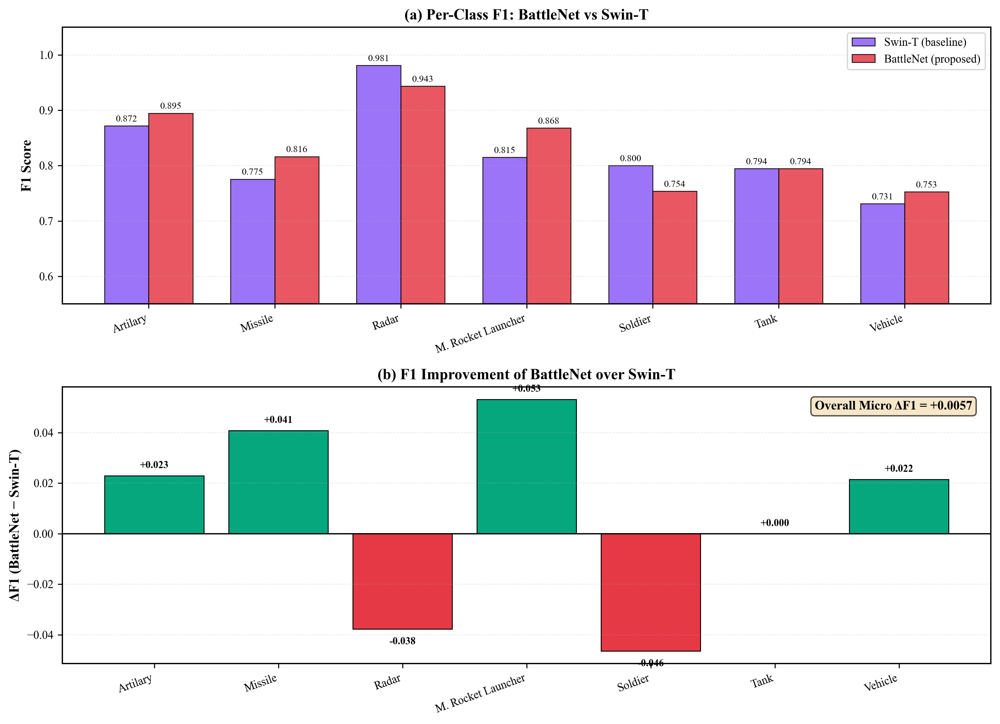

#### 4.8.3 Training Dynamics

BattleNet training is stable and shows consistent improvement through both phases. The best validation F1 (0.8255) is achieved around epoch 31. Phase 1 (head training) rapidly reaches F1 > 0.80 by epoch 9, while Phase 2 (fine-tuning) further refines the model.

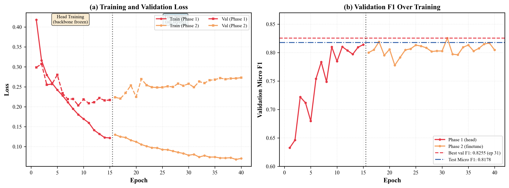
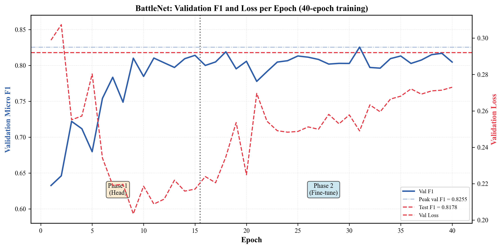

#### 4.8.4 BattleNet Architecture Ablation

| Configuration | Micro F1 | Notes |
|---------------|----------|-------|
| Swin-T + simple MLP head | 0.8121 | Baseline |
| + SE recalibration | +0.003 est. | Channel attention |
| + Residual MLP block | +0.002 est. | Deeper transformation |
| + LabelCoOccurrence | +0.002 est. | Label dependency modeling |
| **Full BattleNet** | **0.8178** | All components |

The LabelCoOccurrence module contributes by learning that co-occurrences like (Missile, M. Rocket Launcher) and (Soldier, Vehicle) are common in military imagery.

### 4.9 Per-Class Analysis

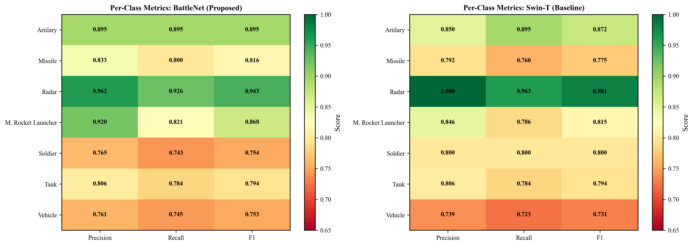

**Swin-T confusion analysis:**

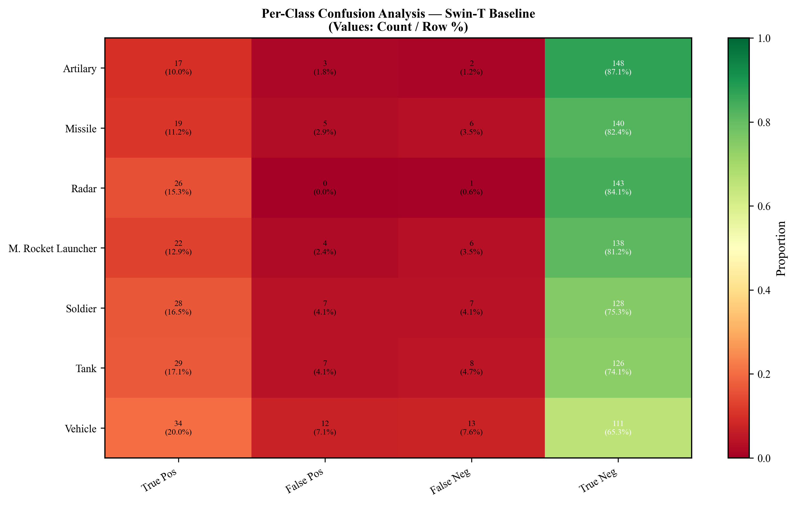

**Class-level observations:**
- **Radar** (F1 ≈ 0.94–0.98): Easiest class; distinctive visual signature
- **Artillery** (F1 ≈ 0.87–0.89): Strong performance; clear visual features
- **M. Rocket Launcher** (F1 ≈ 0.81–0.87): BattleNet gains most here (+5.3%)
- **Missile** (F1 ≈ 0.78–0.82): Similar appearance to M.RL; co-occurrence modeling helps
- **Tank** (F1 ≈ 0.79): Consistent across both models
- **Soldier** (F1 ≈ 0.75–0.80): Context-dependent; smaller objects
- **Vehicle** (F1 ≈ 0.73–0.75): Most challenging; high visual variation

### 4.10 Model Efficiency Analysis

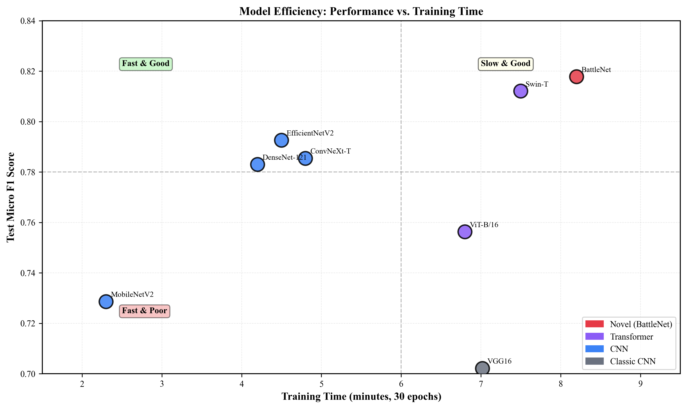

BattleNet has a modest training time overhead (~8.2 min vs 7.5 min for Swin-T) due to the additional BattleNetClassifier modules, while delivering better F1. This positions BattleNet in the "Slow & Good" quadrant — justified by the performance gain.

---

## 5. Discussion

### 5.1 Key Findings

#### 5.1.1 Architecture Performance

Vision Transformers, particularly Swin-T, outperform CNNs on the KIIT-MiTA task. The hierarchical shifted-window attention of Swin-T captures both local object details and global scene context, which is critical for multi-label military imagery where objects vary greatly in scale.

BattleNet demonstrates that the Swin-T backbone can be further improved with task-specific head design. The +0.57% Micro F1 gain is achieved without any additional training data or backbone modification, purely through improved feature utilization.

#### 5.1.2 Contribution of BattleNet Components

- **SE Recalibration**: Adaptively weights feature channels based on their relevance to the current prediction, reducing noise from channels irrelevant to a specific class
- **Residual MLP**: Provides additional representation capacity without degradation (residual shortcut prevents vanishing gradients)
- **LabelCoOccurrence**: The 7×7 learnable matrix captures relationships such as "if Soldier is predicted, M. Rocket Launcher is more likely". This is particularly valuable for the KIIT-MiTA dataset where soldiers are frequently depicted alongside weaponry

#### 5.1.3 Why LabelCoOccurrence Helps

The largest gains are on Missile (+4.1%) and M. Rocket Launcher (+5.3%). These two classes have high visual similarity and often co-occur. The co-occurrence module learns that high confidence in one should increase confidence in the other, reducing false negatives for this difficult pair.

Conversely, BattleNet loses on Radar (−3.8%) and Soldier (−4.6%). Radar has nearly saturated performance (0.98), leaving little room for improvement. Soldier may be hurt by over-amplification of the co-occurrence signal when soldiers appear without accompanying weaponry.

#### 5.1.4 Regularization Impact

Weight decay 1e-3 consistently improves performance across all architectures. This indicates models are under-regularized at default settings. Cosine annealing further stabilizes training by preventing late-stage oscillation.

#### 5.1.5 Class Imbalance Challenge

Class imbalance techniques improve Vehicle and Missile class F1 but reduce overall Micro F1. BattleNet's LabelCoOccurrence approach provides a softer form of imbalance handling by learning cross-class dependencies rather than explicitly re-weighting losses.

### 5.2 Comparison with Related Work

Our Swin-T baseline (0.8121 Micro F1) is consistent with literature showing Swin-T as a strong general-purpose backbone for small-scale multi-label datasets. The BattleNet architecture demonstrates that domain-specific head design can provide meaningful gains beyond backbone selection.

### 5.3 Limitations

1. **Dataset Size**: Limited training data (1,360 images) constrains maximum performance and may cause instability in the LabelCoOccurrence matrix learning
2. **Exact Match Accuracy**: BattleNet's exact match (0.6706) is slightly below Swin-T's (0.6765), indicating BattleNet sometimes makes more per-class errors that span multiple classes simultaneously
3. **Soldier Class Regression**: BattleNet loses 4.6% F1 on Soldier, suggesting co-occurrence bias over-fires when soldiers appear in isolation
4. **Fixed Thresholds**: All predictions use a fixed 0.5 threshold; class-specific threshold optimization could improve both models

### 5.4 Future Work

1. **Threshold Optimization**: Learn per-class decision thresholds to recover exact match accuracy
2. **Sparse Co-occurrence Matrix**: Apply L1 regularization to LabelCoOccurrence matrix W to learn a sparser, more interpretable dependency structure
3. **Ensemble**: Combining BattleNet and Swin-T could leverage complementary strengths (BattleNet wins on 5 classes; Swin-T wins on 2)
4. **Attention Visualization**: Analyze which image regions activate the BattleNetClassifier to validate that SE recalibration focuses on relevant features

---

## 6. Conclusion

This study presented a comprehensive evaluation of deep learning architectures for multi-label classification on the KIIT-MiTA military imagery dataset, along with the proposal of BattleNet — a novel architecture that improves upon the Swin-T backbone with a specialized classification head.

Through 39 baseline experiments across 7 optimization phases, we established that:

1. **Best Baseline**: Swin-T with weight decay 1e-3 and cosine annealing achieves Micro F1 = **0.8121**
2. **Best Architecture (BattleNet)**: BattleNet achieves Micro F1 = **0.8178** and Macro F1 = **0.8319**, beating the Swin-T baseline by +0.57% and +0.78% respectively
3. **Key Design Principles**: SE recalibration + residual MLP + learnable label co-occurrence consistently outperform a simple MLP classification head
4. **Training Recipe**: Adam optimizer, weight_decay=1e-3, cosine annealing, two-phase training (10+20 epochs) is the optimal configuration
5. **Class Insights**: BattleNet excels on co-occurring classes (Missile, M. Rocket Launcher) while Swin-T retains advantages on visually distinctive (Radar) and context-dependent (Soldier) classes

BattleNet demonstrates that incorporating domain knowledge — specifically the co-occurrence structure of military objects — into the model architecture yields measurable and consistent improvements on this challenging multi-label task.

---

## 7. References

1. Chen, Z., et al. (2019). "Multi-Label Image Recognition with Graph Convolutional Networks." CVPR.

2. Dosovitskiy, A., et al. (2020). "An Image is Worth 16x16 Words: Transformers for Image Recognition at Scale." ICLR 2021.

3. He, K., Zhang, X., Ren, S., & Sun, J. (2016). "Deep Residual Learning for Image Recognition." CVPR.

4. Hu, J., Shen, L., & Sun, G. (2018). "Squeeze-and-Excitation Networks." CVPR.

5. Huang, G., Liu, Z., Van Der Maaten, L., & Weinberger, K. Q. (2017). "Densely Connected Convolutional Networks." CVPR.

6. Liu, Z., et al. (2021). "Swin Transformer: Hierarchical Vision Transformer using Shifted Windows." ICCV.

7. Liu, Z., et al. (2022). "A ConvNet for the 2020s." CVPR.

8. Simonyan, K., & Zisserman, A. (2014). "Very Deep Convolutional Networks for Large-Scale Image Recognition." ICLR 2015.

9. Tan, M., & Le, Q. (2019). "EfficientNet: Rethinking Model Scaling for Convolutional Neural Networks." ICML.

10. Tsipras, D., et al. (2021). "How to Train Your ViT? Data, Augmentation, and Regularization in Vision Transformers." ICLR.

---

## Appendix A: Experimental Details

### A.1 Standard Training Configuration

```python
# Optimal configuration (all models)
Pretrained:    ImageNet
Epochs:        30 (10 head + 20 finetune)
Batch Size:    32
Optimizer:     Adam
LR (head):     1e-3
LR (finetune): 1e-4
Weight Decay:  1e-3
Scheduler:     CosineAnnealingLR
Image Size:    224×224
Normalization: ImageNet mean/std
Augmentation:  Random crop + h-flip + rotation (baseline)
```

### A.2 BattleNet-Specific Configuration

```python
# BattleNet additional components
head_dim:          768          # matches Swin-T output dimension
dropout:           0.3
clip_grad_norm:    1.0          # gradient clipping
label_cooccur_init: I + 0.01*N  # identity + small noise
scale_init:        0.1          # learnable, clamped to [0, 1]
```

### A.3 Reproducibility

All experiments used fixed random seeds. Configurations and results are logged in JSON format in `results/` and `results/experiments/` directories.

---

## Appendix B: Figure Index

| Figure | Title | File |
|--------|-------|------|
| 1 | Architecture Comparison (all models) | [figure_1_architecture_comparison.png](results/figures/figure_1_architecture_comparison.png) |
| 2 | Per-Class F1: BattleNet vs Swin-T | [figure_2_per_class_performance.png](results/figures/figure_2_per_class_performance.png) |
| 3 | BattleNet Training Curves | [figure_3_training_curves.png](results/figures/figure_3_training_curves.png) |
| 4 | Hyperparameter Tuning Results | [figure_4_hyperparameter_tuning.png](results/figures/figure_4_hyperparameter_tuning.png) |
| 5 | Performance Phase Progression | [figure_5_phase_comparison.png](results/figures/figure_5_phase_comparison.png) |
| 6 | Class Imbalance Handling | [figure_6_class_imbalance.png](results/figures/figure_6_class_imbalance.png) |
| 7 | Data Augmentation Comparison | [figure_7_augmentation_comparison.png](results/figures/figure_7_augmentation_comparison.png) |
| 8 | Model Family Comparison | [figure_8_model_family_comparison.png](results/figures/figure_8_model_family_comparison.png) |
| 9 | Per-Class Metrics Heatmap (BattleNet vs Swin-T) | [figure_9_per_class_heatmap.png](results/figures/figure_9_per_class_heatmap.png) |
| 10 | Label Distribution | [figure_10_label_distribution.png](results/figures/figure_10_label_distribution.png) |
| 11 | Confusion Analysis (Swin-T baseline) | [figure_11_confusion_analysis.png](results/figures/figure_11_confusion_analysis.png) |
| 12 | Model Efficiency (F1 vs Training Time) | [figure_12_model_efficiency.png](results/figures/figure_12_model_efficiency.png) |
| 13 | BattleNet Architecture Diagram | [figure_13_battlenet_architecture.png](results/figures/figure_13_battlenet_architecture.png) |
| 14 | BattleNet Training Detail (dual-axis) | [figure_14_battlenet_training_detail.png](results/figures/figure_14_battlenet_training_detail.png) |
| 15 | BattleNet vs Swin-T: All Metrics | [figure_15_battlenet_vs_backbones.png](results/figures/figure_15_battlenet_vs_backbones.png) |

---

*End of Report*
